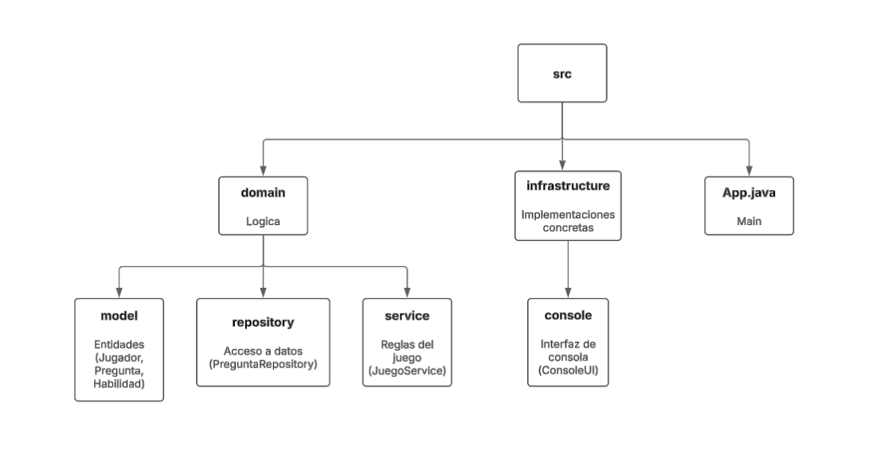

# 🕹️ Juego de Preguntas y Respuestas con SOLID

**Autor:** Serhii Turtsanash

---

## 🎯 Descripción del Proyecto

Este proyecto es un juego de preguntas y respuestas por niveles en el que el jugador:
- 🏆 **Selecciona habilidades especiales** (pistas, eliminar opciones, recuperar vida, intento adicional).
- ⏳ **Responde preguntas bajo presión de tiempo** (pierde vida si tarda demasiado).
- 🎢 **Avanza niveles con dificultad creciente**.
- 🎯 **Gana puntos según su eficiencia**.

### 🎯 **Objetivo Principal**
Aplicar los principios **SOLID** y patrones de diseño para mejorar la mantenibilidad del código respecto a la primera iteración.

---

## 🏗️ Arquitectura por Capas

---

## 🏛️ Principios SOLID Aplicados

✅ **S** - Responsabilidad Única: Cada clase tiene una única responsabilidad. Ejemplo: `JuegoService` maneja la lógica, `ConsoleUI` solo la interfaz.  
✅ **O** - Abierto/Cerrado: Se pueden añadir nuevas habilidades sin modificar código existente.  
✅ **L** - Sustitución de Liskov: Las clases hijas pueden sustituir a sus padres sin afectar el comportamiento.  
✅ **I** - Segregación de Interfaces: Se definen interfaces específicas en lugar de una genérica.  
✅ **D** - Inversión de Dependencias: `JuegoService` depende de la abstracción `PreguntaRepository`, no de una implementación concreta.

---

## 🔍 Mejoras de Diseño vs Iteración Anterior

✔️ **Más fácil de mantener y testear** 🔧  
✔️ **Agregar nuevas habilidades sin modificar código existente** 🚀  
✔️ **Las clases no dependen de implementaciones concretas** 🏗️

---

## 🔮 Futuras Mejoras

### 📂 **Persistencia:**
- Guardar progreso en **JSON/SQLite**.
- Implementar **ranking de jugadores**.

### 🆕 **Nuevas Funcionalidades:**
- ⏳ Habilidad "**Congelar tiempo**" (detener temporizador).
- ✅ Preguntas **multirespuesta**.

### 🛠️ **Mejoras Técnicas:**
- 📌 **Tests unitarios** con JUnit.

### 🎨 **Interfaz Gráfica:**
- 🌐 **Aplicación web**.

---

## 🏁 Conclusiones

🎯 **Objetivos Cumplidos:**
- ✅ Arquitectura limpia y desacoplada.
- ✅ Código más mantenible y extensible.
- ✅ Implementación completa de SOLID.

🚀 **Próximos Pasos:**
- Implementar **persistencia y tests** para consolidar la calidad del código.

---
